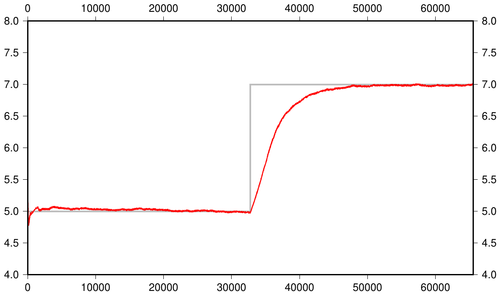

Capacity
========

The base algorithm, as described in the paper, has no facility
for handling a median of a "window" of data; the histogram data
structure is a _préciss_ of all of the values that have ever been
thrown at it, but has "forgotton" when they were added and how
big they were, remembering only the affect they had on the existing
bins (and that affect persists the bins' dynamic changes).

There _are_ papers dealing with such finite-window median
approximations, but they do seem to be rather complicated; much
more so than the simple dynamic-histogram implemented here. We
here propose a modification to the algorithm which solves a
different but related problem -- how can we have a structure which
gradually forgets the older data, so that a change in the input
data's distrubution will be reflected in a change in the output
approximate median _regardless of the amount of data which has
previously been processed_.

The idea is very simple.  We have a value which is the "capacity"
of the histogram, this being the maximum value that the histogram
total count can be.  If the count is less than teh capacity then
we do nothing; if, on adding a new data point, the total count is
above the capacity then we scale the counts of the histogram so
that the total count is _exactly_ the capacity.  Since we add
values one-at-a-time, this will typically be a scaling by

	capacity / (capacity + 1)

i.e., each count is repeatedly multiplied by a number slightly
smaller than 1.0.  This (in the absence of bin dynamics) will
result in an _exponential decay_ to older count values.

In the [examples directory](../examples/series-capacity/) we have
some code which sends data with a Gausaiam distribution, mean 5.0,
standard devaiation 1.0 for several thousand samples, followed by
the same number with a _different_ distribution (same variance but
mean 7.0) and plot the evolution of the resultion approximate
median, the results shown right.
