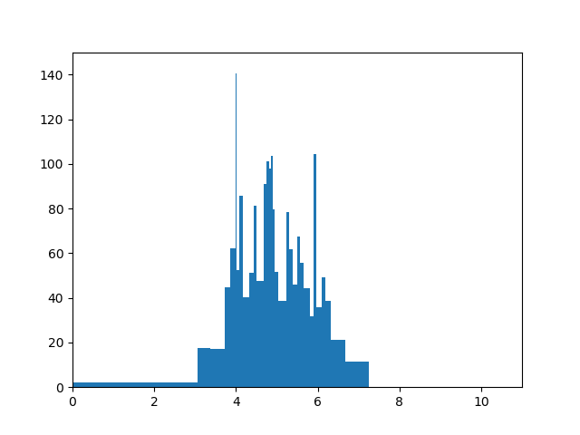
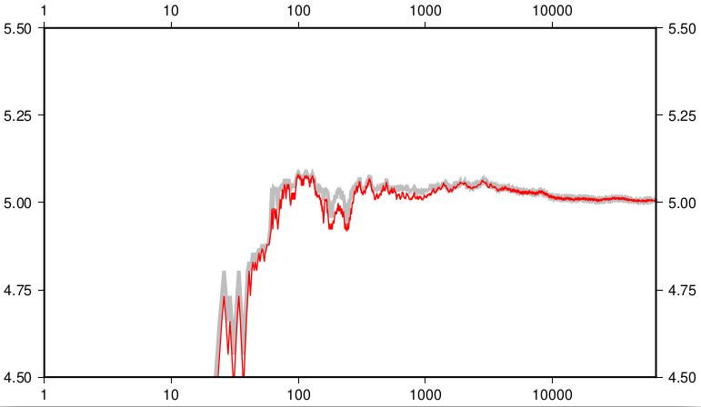

Implementation
==============

Overview
--------

We briefly describe the algorithm, to spare the reader the
hassle of finding the paper.

The idea is to have a fixed-sized data structure which can
be updated with new data-points and from which an approximate
median value can be calculated.  Unsurprisingly this
data-structure is an approximation to the (a) histogram of the
previously added data-points.  The bins of the histogram are
not equal in size, and adding a new data-point to the structure
will (typically) change the end-points of the bins.  There is
a (user-defined) maximum number of bins in the histogram, hence
the fixed-size of the structure.

For technical reasons it is assumed that the data-points are
positive, one could take the exponential of the data if this
were not the case.

The histogram bins are represented by the upper limit of the
bin, and the count of data-points which have fallen into it.
One does not need to store the lower-limit of the bin since
that is the upper-limit of the previous bin.

Imagine that we have such a histogram, and that a new data-point
is to be inserted.  We search for a bin into which it falls: if
there isn't one (i.e., if the data-point is larger than any one
seen so far) then we create a new bin whose maximum is the value
and whose count is 1; If there is one, then we split that bin into
two with the value of the data-point as the upper limit of the
lower bin (into which the data point is assumed to have fallen)
and the lower bound of the upper bin.  These two bins need to have
the count of their parent distributed amongst them, and this is
done by a linear interpolation from the value of the data-point.
This means that counts *in a bin* will generally be non-integer
(even though the total over all bins will be an integer, at least
up to floating point error accumulation).



But now we have one bin too many, so we seek to merge two
adjacent bins.  This choice is made in such a way as to maximise
the *entropy* of the resulting histogram.  In practice this
means to have roughly equal counts for each bin, and since the
count is (or can be thought of) as the *area* of the bin, roughly
equal areas.  So we end up with thin tall bins where the data
is dense, short fat bins where it is sparse.

Calculating the approximate median from this data-structure is
straightforward, since it is just the 50% quartile of the
cumulative density function of the histogram.  We walk through
the nodes of the histogram, summing the counts until we find
the bin which straddles this 50%, then perform an (inverse)
linear interpolation to find the required value.


Data structures
---------------

The set of bins is implemented as a (singly-) linked list of
`node_t`,
```c
struct bin_t
{
  double max, count;
};

struct node_t
{
  bin_t bin;
  node_t *next;
};
```
This is a friendly structure for the splitting and merging
of bins described above.  Traversing the list (as needed to
find the median-bin) is of course a linked-list traversal,
an operation which is typically slow compared to array
traversal (particularly on modern hardware), but the number of
bins is small, 20--50, so this is barely an issue.


One *could* use a tree-like structure instead, but I would
expect that this would add complexity (we need to access the
lower-bin in order to determine the range of the bin, and
we'd also need to iterate over all bins in order to calculate
the median as discussed above, so a vanilla tree library would
probably need to be customised) while only having a marginal
effect on speed, like a cyclist shaving his/her legs.


Evaluation
----------



In addition to the [unit tests](../test/), we have have some
[scripts](../examples/series-compare/) to create plots (right)
which compare the approximation (red) to the exact value for
random (Gaussian) input data (grey); the results are similar to
the plots show in the paper, the approximation improves with
the number of points processed and aligns to the exact result.
This gives us "sniff test" confidence in the implementation.

In terms of speed, in generating the data for these plots we
record that adding 64,000 samples to a 64-bin histogram, along
with 64,000 medians evaluated takes 0.34s.  By contrast, the
exact values (obtained by Numpy) take 30s.  Since the time
taken in the exact calculation is, of necessity, at least
linear in the number of points, while the approximation takes
constant time, we can make this "two orders of magnitude"
improvement as large as we like, just by taking more data
points.
